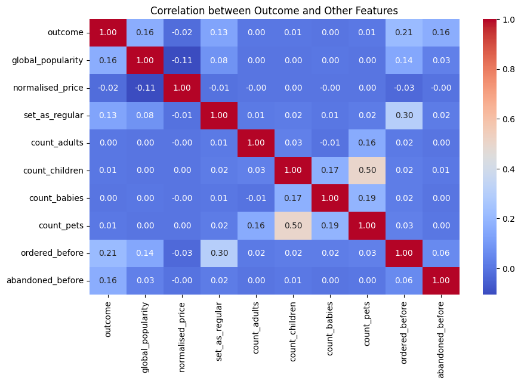
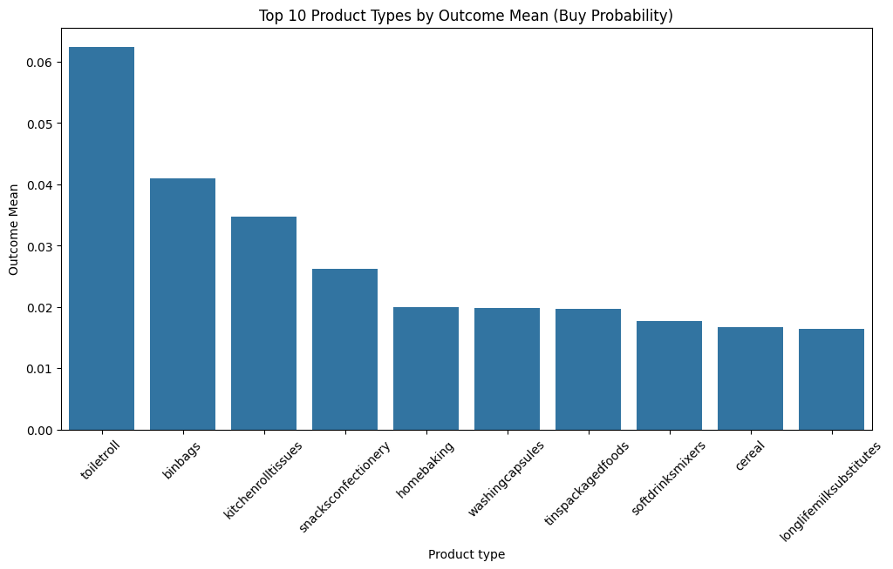
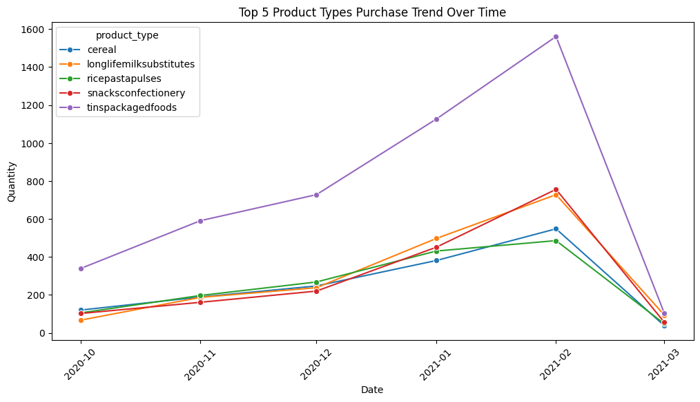

```python
import pandas as pd
import matplotlib.pyplot as plt
import seaborn as sns
```


```python
df = pd.read_csv('./data/groceries/box_builder_dataset/feature_frame.csv')
```


```python
df.info()
```

    <class 'pandas.core.frame.DataFrame'>
    RangeIndex: 2880549 entries, 0 to 2880548
    Data columns (total 27 columns):
     #   Column                            Dtype  
    ---  ------                            -----  
     0   variant_id                        int64  
     1   product_type                      object 
     2   order_id                          int64  
     3   user_id                           int64  
     4   created_at                        object 
     5   order_date                        object 
     6   user_order_seq                    int64  
     7   outcome                           float64
     8   ordered_before                    float64
     9   abandoned_before                  float64
     10  active_snoozed                    float64
     11  set_as_regular                    float64
     12  normalised_price                  float64
     13  discount_pct                      float64
     14  vendor                            object 
     15  global_popularity                 float64
     16  count_adults                      float64
     17  count_children                    float64
     18  count_babies                      float64
     19  count_pets                        float64
     20  people_ex_baby                    float64
     21  days_since_purchase_variant_id    float64
     22  avg_days_to_buy_variant_id        float64
     23  std_days_to_buy_variant_id        float64
     24  days_since_purchase_product_type  float64
     25  avg_days_to_buy_product_type      float64
     26  std_days_to_buy_product_type      float64
    dtypes: float64(19), int64(4), object(4)
    memory usage: 593.4+ MB
    


```python
df['created_at'] = pd.to_datetime(df['created_at'])
df['order_date'] = pd.to_datetime(df['order_date'])

df.isnull().sum()
```


    variant_id                          0
    product_type                        0
    order_id                            0
    user_id                             0
    created_at                          0
    order_date                          0
    user_order_seq                      0
    outcome                             0
    ordered_before                      0
    abandoned_before                    0
    active_snoozed                      0
    set_as_regular                      0
    normalised_price                    0
    discount_pct                        0
    vendor                              0
    global_popularity                   0
    count_adults                        0
    count_children                      0
    count_babies                        0
    count_pets                          0
    people_ex_baby                      0
    days_since_purchase_variant_id      0
    avg_days_to_buy_variant_id          0
    std_days_to_buy_variant_id          0
    days_since_purchase_product_type    0
    avg_days_to_buy_product_type        0
    std_days_to_buy_product_type        0
    dtype: int64


No row nulls in the data. 


```python
interesting_cols = ['outcome','global_popularity', 'normalised_price', 'set_as_regular', 'count_adults', 'count_children'
                , 'count_babies', 'count_pets', 'ordered_before', 'abandoned_before']

correlation_matrix = df[interesting_cols].corr(numeric_only=True)

plt.figure(figsize=(10, 6))
sns.heatmap(correlation_matrix, annot=True, cmap='coolwarm', fmt='.2f')
plt.title('Correlation between Outcome and Other Features')
plt.show()
```


    

    


```python
bought_products = df[df['outcome'] == 1]

info_per_order = bought_products.groupby('order_id').size()
info_per_order.describe()
```


    count    3427.000000
    mean        9.697111
    std         6.789204
    min         1.000000
    25%         5.000000
    50%         9.000000
    75%        13.000000
    max        78.000000
    dtype: float64


```python
product_outcome_means = df.groupby('product_type')['outcome'].mean().sort_values(ascending=False).head(10).reset_index()

plt.figure(figsize=(12, 6))
sns.barplot(x=product_outcome_means['product_type'], y=product_outcome_means['outcome'])
plt.title('Top 10 Product Types by Outcome Mean (Buy Probability)')
plt.xlabel('Product type')
plt.ylabel('Outcome Mean')
plt.xticks(rotation=45)
plt.show()
```


    

    


After calculating the 'Outcome' mean of each type_product, the number of times it is purchased with respect to the entire dataset, we can observe the probability of purchase for each type of product. With this information we can see that the products with the highest probability of purchase are staple products that everyone uses and that are purchased frequently, such as toilet rolls or bin bags.

Now let's try to observe the evolution over time of the most sold types of products, to see if any of them have a different trend or follow a different pattern of purchase depending on the date.


```python
top_product_types = bought_products['product_type'].value_counts().head(5).index

df_top_products = bought_products[bought_products['product_type'].isin(top_product_types)]
df_top_products['order_date'] = df_top_products['order_date'].dt.to_period('M').dt.to_timestamp()
df_grouped = df_top_products.groupby([df_top_products['order_date'], 'product_type']).size().reset_index(name='count')
```


```python
plt.figure(figsize=(12, 6))
sns.lineplot(data=df_grouped, x='order_date', y='count',hue='product_type', marker='o')
plt.title('Top 5 Product Types Purchase Trend Over Time')
plt.xlabel('Date')
plt.ylabel('Quantity')
plt.xticks(rotation=45)
plt.show()
```


    

    


We can see that the products, in their magnitude, follow a very similar trend, so that no influence of time on the purchase pattern can be observed.
The drop in purchases in March 2021 is due to the lack of data for this month, as the latest data recorded is from 2021-03-03. 

Insights:
- 75 % of orders are smaller than 13 products.
- Previous experience with a product influences the purchase decision.
- Global popularity appears to be an influential factor when purchasing a product, meaning the marketing strategy is important.
- Variables such as set_as_regular and ordered_before show a significant correlation with each other, suggesting that the more a product is ordered, the more likely it is to be set as regular.
- Products with most probability the be bought are basics products that everyone uses and that are purchased frequently, such as toilet rolls or bin bags.
- There no clear influence of time on the purchase pattern of the most sold products. All of them follow a very similar trend.
