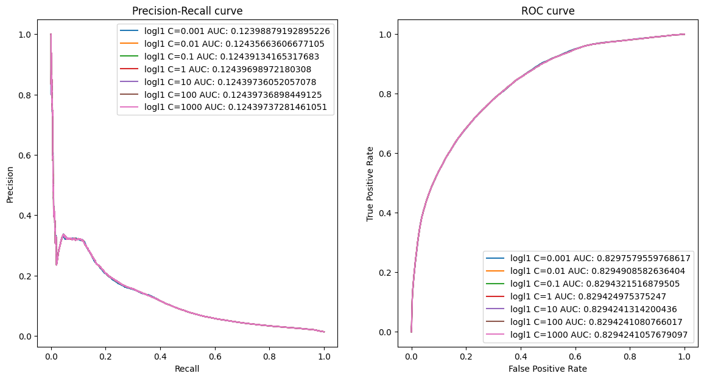
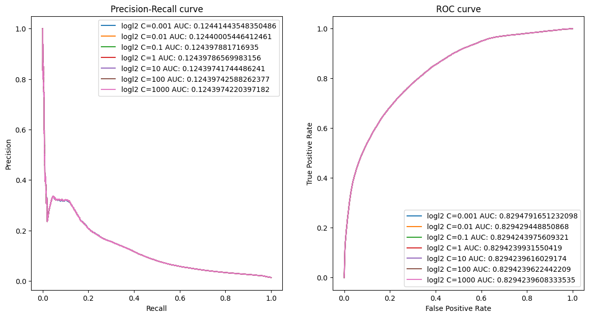
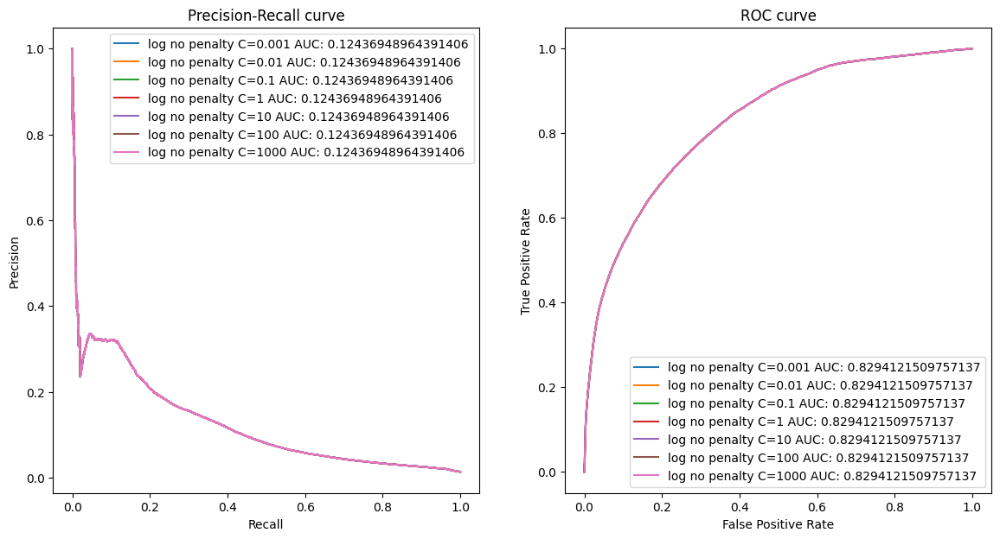
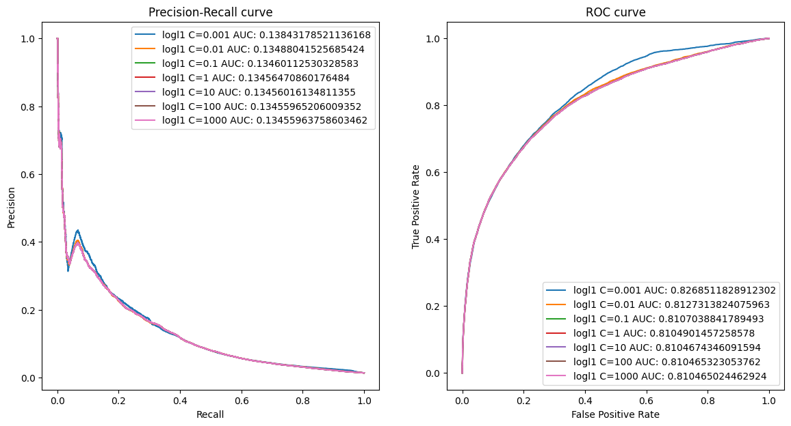
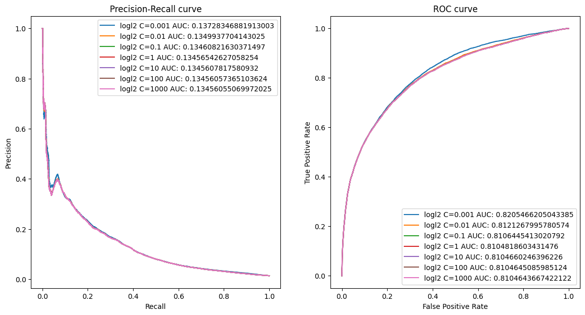
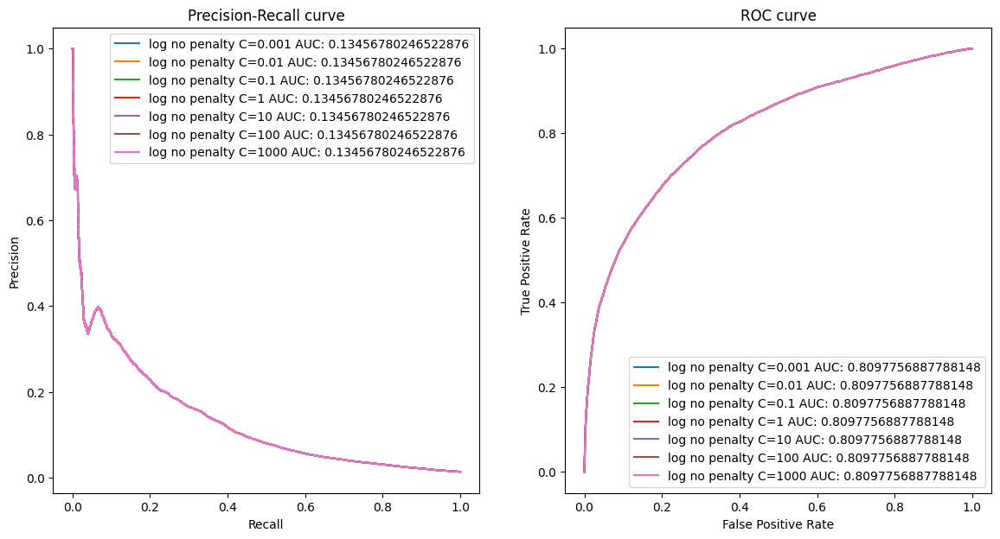
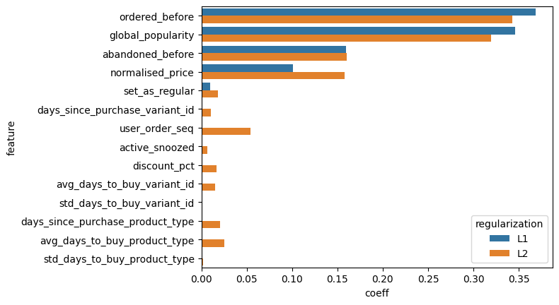
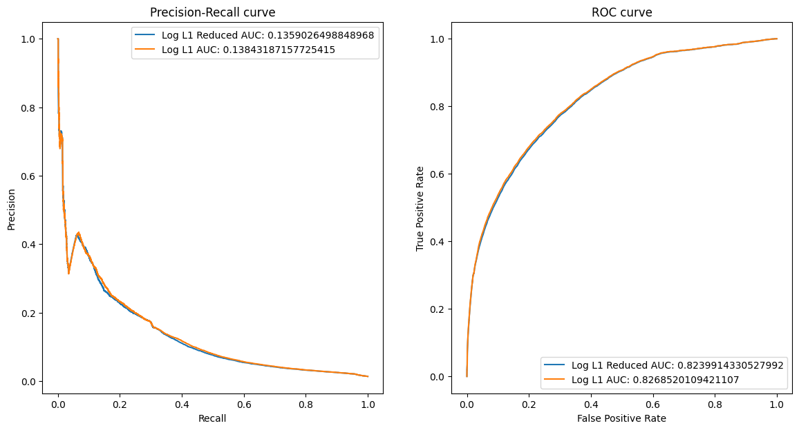
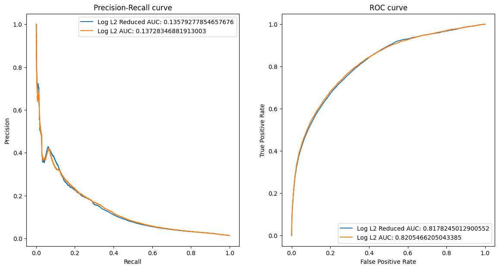

```python
import pandas as pd
import numpy as np
from sklearn.model_selection import train_test_split
from sklearn.preprocessing import StandardScaler
from sklearn.linear_model import LogisticRegression
from sklearn.metrics import roc_curve, auc, precision_recall_curve, roc_auc_score
import matplotlib.pyplot as plt
import seaborn as sns
```


```python
products_df = pd.read_csv('./data/feature_frame.csv')
```


```python
def get_relevant_orders_df(df: pd.DataFrame, num_orders: int) -> pd.DataFrame:
    """We get the orders that have more or equal than num_orders products bought"""
    bought_products = df.query('outcome == 1')
    orders_relevants = bought_products.groupby('order_id')['variant_id'].agg(lambda x: len(list(x))).reset_index().query(f'variant_id >= {num_orders}')
    return df.merge(orders_relevants[['order_id']], on='order_id')
```


```python
filtered_df = get_relevant_orders_df(products_df, 5)
```


```python
print(f"Original number of orders: {products_df['order_id'].nunique()}")
print(f"Orders bigger or equal than 5: {filtered_df['order_id'].nunique()}")
```

    Original number of orders: 3446
    Orders bigger or equal than 5: 2603
    


```python
filtered_df['order_date'] = pd.to_datetime(filtered_df['order_date']).dt.date
filtered_df['created_at'] = pd.to_datetime(filtered_df['created_at'])
```


```python
info_cols = ['variant_id','order_id','user_id',"created_at","order_date"]

count_cols = ['count_adults', 'count_children',
       'count_babies', 'count_pets', 'people_ex_baby']

categorical_cols = ['vendor', 'product_type']
```


```python
filtered_df[categorical_cols].nunique()
```


    vendor          264
    product_type     62
    dtype: int64


- Id and date columns are not used for the prediction, so we drop them.
- Count columns are unreliable since the majority of the data were non-existent and were imputed with the mean as we saw at the EDA. We drop them.
- Categorical cols are not used in the model, due to the amount of cardinality. We drop them.


```python
X = filtered_df.drop(['outcome']+info_cols+categorical_cols+count_cols, axis=1)
Y = filtered_df['outcome']
```


```python
X.info()
```

    <class 'pandas.core.frame.DataFrame'>
    RangeIndex: 2163953 entries, 0 to 2163952
    Data columns (total 14 columns):
     #   Column                            Dtype  
    ---  ------                            -----  
     0   user_order_seq                    int64  
     1   ordered_before                    float64
     2   abandoned_before                  float64
     3   active_snoozed                    float64
     4   set_as_regular                    float64
     5   normalised_price                  float64
     6   discount_pct                      float64
     7   global_popularity                 float64
     8   days_since_purchase_variant_id    float64
     9   avg_days_to_buy_variant_id        float64
     10  std_days_to_buy_variant_id        float64
     11  days_since_purchase_product_type  float64
     12  avg_days_to_buy_product_type      float64
     13  std_days_to_buy_product_type      float64
    dtypes: float64(13), int64(1)
    memory usage: 231.1 MB
    


```python
X_train, X_valtest, Y_train, Y_valtest = train_test_split(X, Y, test_size=0.7, random_state=15,shuffle=False)
X_val, X_test, Y_val, Y_test = train_test_split(X_valtest, Y_valtest, test_size=0.5, random_state=15,shuffle=False)


scaler = StandardScaler()
X_train = scaler.fit_transform(X_train)
X_val = scaler.transform(X_val)
X_test = scaler.transform(X_test)
```


```python
def plot_roc__pr_curves(model_name:str,y_pred: pd.Series,y_test:pd.Series, 
                        figure = None):
     
    precision,recall, _ = precision_recall_curve(y_test, y_pred)
    pr_auc = auc(recall, precision)
    
    fpr, tpr, _ = roc_curve(y_test, y_pred)
    roc_auc = roc_auc_score(y_test, y_pred)

      
    if figure is None:
        fig, ax = plt.subplots(1, 2, figsize=(14, 7))
    else:
        fig,ax = figure
        
        
    ax[0].plot(recall, precision, label=f"{model_name} AUC: {pr_auc}")
    ax[0].set_xlabel('Recall')
    ax[0].set_ylabel('Precision')
    ax[0].set_title('Precision-Recall curve')
    ax[0].legend()
    
    ax[1].plot(fpr, tpr, label=f"{model_name} AUC: {roc_auc}")
    ax[1].set_xlabel('False Positive Rate')
    ax[1].set_ylabel('True Positive Rate')
    ax[1].set_title('ROC curve')
    ax[1].legend()
```


```python
params = {
    'C': [0.001,0.01, 0.1, 1, 10, 100,1000]
}

fig1,ax1 = plt.subplots(1,2,figsize=(14,7))
fig2,ax2 = plt.subplots(1,2,figsize=(14,7))
fig3,ax3 = plt.subplots(1,2,figsize=(14,7))

for c in params['C']:
    
    log_l1 = LogisticRegression(class_weight='balanced',solver='liblinear',penalty='l1',C=c ,random_state=15)
    log_l1.fit(X_train,Y_train)
    predicts = log_l1.predict_proba(X_val)[:,1]
    plot_roc__pr_curves(f"logl1 C={c}",y_pred = predicts,y_test = Y_val,figure=(fig1,ax1))

    log_l2 = LogisticRegression(class_weight='balanced',solver='liblinear',C=c,penalty='l2',random_state=15)
    log_l2.fit(X_train,Y_train)
    predicts = log_l2.predict_proba(X_val)[:,1]
    plot_roc__pr_curves(f"logl2 C={c}",y_pred = predicts,y_test = Y_val,figure=(fig2,ax2))
    
    log_no = LogisticRegression(class_weight='balanced',penalty=None,random_state=15)
    log_no.fit(X_train,Y_train)
    predicts = log_no.predict_proba(X_val)[:,1]
    plot_roc__pr_curves(f"log no penalty C={c}",y_pred = predicts,y_test = Y_val,figure=(fig3,ax3))

```


    

    


    

    


    

    


```python
params = {
    'C': [0.001,0.01, 0.1, 1, 10, 100,1000]
}

fig1,ax1 = plt.subplots(1,2,figsize=(14,7))
fig2,ax2 = plt.subplots(1,2,figsize=(14,7))
fig3,ax3 = plt.subplots(1,2,figsize=(14,7))

for c in params['C']:
    
    log_l1 = LogisticRegression(solver='liblinear',penalty='l1',C=c ,random_state=15)
    log_l1.fit(X_train,Y_train)
    predicts = log_l1.predict_proba(X_val)[:,1]
    plot_roc__pr_curves(f"logl1 C={c}",y_pred = predicts,y_test = Y_val,figure=(fig1,ax1))

    log_l2 = LogisticRegression(solver='liblinear',C=c,penalty='l2',random_state=15)
    log_l2.fit(X_train,Y_train)
    predicts = log_l2.predict_proba(X_val)[:,1]
    plot_roc__pr_curves(f"logl2 C={c}",y_pred = predicts,y_test = Y_val,figure=(fig2,ax2))
    
    log_no = LogisticRegression(penalty=None,random_state=15)
    log_no.fit(X_train,Y_train)
    predicts = log_no.predict_proba(X_val)[:,1]
    plot_roc__pr_curves(f"log no penalty C={c}",y_pred = predicts,y_test = Y_val,figure=(fig3,ax3))
```


    

    


    

    


    

    


- Models with balanced class weights show slightly worse results than unbalanced models in the Precision-Recall curve, in the case of the ROC curve it is the opposite case with slightly better values.
- At weight balanced models, we see no difference between models with most regularization and models with least regularization.
- At nonbalanced models, model with most regularization show slightly better results -> C= 0.001

We won't use class weights balanced models since the parameter 'class_weight=balanced' is removing the importance of the penalty type and the value of C and we cannot make a study of the coefficients.


```python
log_l1 = LogisticRegression(solver='liblinear',C=0.001,penalty='l1')
log_l1.fit(X_train,Y_train)

log_l2 = LogisticRegression(solver='liblinear',C=0.001,penalty='l2')
log_l2.fit(X_train,Y_train)
```


<style>#sk-container-id-1 {
  /* Definition of color scheme common for light and dark mode */
  --sklearn-color-text: black;
  --sklearn-color-line: gray;
  /* Definition of color scheme for unfitted estimators */
  --sklearn-color-unfitted-level-0: #fff5e6;
  --sklearn-color-unfitted-level-1: #f6e4d2;
  --sklearn-color-unfitted-level-2: #ffe0b3;
  --sklearn-color-unfitted-level-3: chocolate;
  /* Definition of color scheme for fitted estimators */
  --sklearn-color-fitted-level-0: #f0f8ff;
  --sklearn-color-fitted-level-1: #d4ebff;
  --sklearn-color-fitted-level-2: #b3dbfd;
  --sklearn-color-fitted-level-3: cornflowerblue;

  /* Specific color for light theme */
  --sklearn-color-text-on-default-background: var(--sg-text-color, var(--theme-code-foreground, var(--jp-content-font-color1, black)));
  --sklearn-color-background: var(--sg-background-color, var(--theme-background, var(--jp-layout-color0, white)));
  --sklearn-color-border-box: var(--sg-text-color, var(--theme-code-foreground, var(--jp-content-font-color1, black)));
  --sklearn-color-icon: #696969;

  @media (prefers-color-scheme: dark) {
    /* Redefinition of color scheme for dark theme */
    --sklearn-color-text-on-default-background: var(--sg-text-color, var(--theme-code-foreground, var(--jp-content-font-color1, white)));
    --sklearn-color-background: var(--sg-background-color, var(--theme-background, var(--jp-layout-color0, #111)));
    --sklearn-color-border-box: var(--sg-text-color, var(--theme-code-foreground, var(--jp-content-font-color1, white)));
    --sklearn-color-icon: #878787;
  }
}

#sk-container-id-1 {
  color: var(--sklearn-color-text);
}

#sk-container-id-1 pre {
  padding: 0;
}

#sk-container-id-1 input.sk-hidden--visually {
  border: 0;
  clip: rect(1px 1px 1px 1px);
  clip: rect(1px, 1px, 1px, 1px);
  height: 1px;
  margin: -1px;
  overflow: hidden;
  padding: 0;
  position: absolute;
  width: 1px;
}

#sk-container-id-1 div.sk-dashed-wrapped {
  border: 1px dashed var(--sklearn-color-line);
  margin: 0 0.4em 0.5em 0.4em;
  box-sizing: border-box;
  padding-bottom: 0.4em;
  background-color: var(--sklearn-color-background);
}

#sk-container-id-1 div.sk-container {
  /* jupyter's `normalize.less` sets `[hidden] { display: none; }`
     but bootstrap.min.css set `[hidden] { display: none !important; }`
     so we also need the `!important` here to be able to override the
     default hidden behavior on the sphinx rendered scikit-learn.org.
     See: https://github.com/scikit-learn/scikit-learn/issues/21755 */
  display: inline-block !important;
  position: relative;
}

#sk-container-id-1 div.sk-text-repr-fallback {
  display: none;
}

div.sk-parallel-item,
div.sk-serial,
div.sk-item {
  /* draw centered vertical line to link estimators */
  background-image: linear-gradient(var(--sklearn-color-text-on-default-background), var(--sklearn-color-text-on-default-background));
  background-size: 2px 100%;
  background-repeat: no-repeat;
  background-position: center center;
}

/* Parallel-specific style estimator block */

#sk-container-id-1 div.sk-parallel-item::after {
  content: "";
  width: 100%;
  border-bottom: 2px solid var(--sklearn-color-text-on-default-background);
  flex-grow: 1;
}

#sk-container-id-1 div.sk-parallel {
  display: flex;
  align-items: stretch;
  justify-content: center;
  background-color: var(--sklearn-color-background);
  position: relative;
}

#sk-container-id-1 div.sk-parallel-item {
  display: flex;
  flex-direction: column;
}

#sk-container-id-1 div.sk-parallel-item:first-child::after {
  align-self: flex-end;
  width: 50%;
}

#sk-container-id-1 div.sk-parallel-item:last-child::after {
  align-self: flex-start;
  width: 50%;
}

#sk-container-id-1 div.sk-parallel-item:only-child::after {
  width: 0;
}

/* Serial-specific style estimator block */

#sk-container-id-1 div.sk-serial {
  display: flex;
  flex-direction: column;
  align-items: center;
  background-color: var(--sklearn-color-background);
  padding-right: 1em;
  padding-left: 1em;
}


/* Toggleable style: style used for estimator/Pipeline/ColumnTransformer box that is
clickable and can be expanded/collapsed.
- Pipeline and ColumnTransformer use this feature and define the default style
- Estimators will overwrite some part of the style using the `sk-estimator` class
*/

/* Pipeline and ColumnTransformer style (default) */

#sk-container-id-1 div.sk-toggleable {
  /* Default theme specific background. It is overwritten whether we have a
  specific estimator or a Pipeline/ColumnTransformer */
  background-color: var(--sklearn-color-background);
}

/* Toggleable label */
#sk-container-id-1 label.sk-toggleable__label {
  cursor: pointer;
  display: block;
  width: 100%;
  margin-bottom: 0;
  padding: 0.5em;
  box-sizing: border-box;
  text-align: center;
}

#sk-container-id-1 label.sk-toggleable__label-arrow:before {
  /* Arrow on the left of the label */
  content: "▸";
  float: left;
  margin-right: 0.25em;
  color: var(--sklearn-color-icon);
}

#sk-container-id-1 label.sk-toggleable__label-arrow:hover:before {
  color: var(--sklearn-color-text);
}

/* Toggleable content - dropdown */

#sk-container-id-1 div.sk-toggleable__content {
  max-height: 0;
  max-width: 0;
  overflow: hidden;
  text-align: left;
  /* unfitted */
  background-color: var(--sklearn-color-unfitted-level-0);
}

#sk-container-id-1 div.sk-toggleable__content.fitted {
  /* fitted */
  background-color: var(--sklearn-color-fitted-level-0);
}

#sk-container-id-1 div.sk-toggleable__content pre {
  margin: 0.2em;
  border-radius: 0.25em;
  color: var(--sklearn-color-text);
  /* unfitted */
  background-color: var(--sklearn-color-unfitted-level-0);
}

#sk-container-id-1 div.sk-toggleable__content.fitted pre {
  /* unfitted */
  background-color: var(--sklearn-color-fitted-level-0);
}

#sk-container-id-1 input.sk-toggleable__control:checked~div.sk-toggleable__content {
  /* Expand drop-down */
  max-height: 200px;
  max-width: 100%;
  overflow: auto;
}

#sk-container-id-1 input.sk-toggleable__control:checked~label.sk-toggleable__label-arrow:before {
  content: "▾";
}

/* Pipeline/ColumnTransformer-specific style */

#sk-container-id-1 div.sk-label input.sk-toggleable__control:checked~label.sk-toggleable__label {
  color: var(--sklearn-color-text);
  background-color: var(--sklearn-color-unfitted-level-2);
}

#sk-container-id-1 div.sk-label.fitted input.sk-toggleable__control:checked~label.sk-toggleable__label {
  background-color: var(--sklearn-color-fitted-level-2);
}

/* Estimator-specific style */

/* Colorize estimator box */
#sk-container-id-1 div.sk-estimator input.sk-toggleable__control:checked~label.sk-toggleable__label {
  /* unfitted */
  background-color: var(--sklearn-color-unfitted-level-2);
}

#sk-container-id-1 div.sk-estimator.fitted input.sk-toggleable__control:checked~label.sk-toggleable__label {
  /* fitted */
  background-color: var(--sklearn-color-fitted-level-2);
}

#sk-container-id-1 div.sk-label label.sk-toggleable__label,
#sk-container-id-1 div.sk-label label {
  /* The background is the default theme color */
  color: var(--sklearn-color-text-on-default-background);
}

/* On hover, darken the color of the background */
#sk-container-id-1 div.sk-label:hover label.sk-toggleable__label {
  color: var(--sklearn-color-text);
  background-color: var(--sklearn-color-unfitted-level-2);
}

/* Label box, darken color on hover, fitted */
#sk-container-id-1 div.sk-label.fitted:hover label.sk-toggleable__label.fitted {
  color: var(--sklearn-color-text);
  background-color: var(--sklearn-color-fitted-level-2);
}

/* Estimator label */

#sk-container-id-1 div.sk-label label {
  font-family: monospace;
  font-weight: bold;
  display: inline-block;
  line-height: 1.2em;
}

#sk-container-id-1 div.sk-label-container {
  text-align: center;
}

/* Estimator-specific */
#sk-container-id-1 div.sk-estimator {
  font-family: monospace;
  border: 1px dotted var(--sklearn-color-border-box);
  border-radius: 0.25em;
  box-sizing: border-box;
  margin-bottom: 0.5em;
  /* unfitted */
  background-color: var(--sklearn-color-unfitted-level-0);
}

#sk-container-id-1 div.sk-estimator.fitted {
  /* fitted */
  background-color: var(--sklearn-color-fitted-level-0);
}

/* on hover */
#sk-container-id-1 div.sk-estimator:hover {
  /* unfitted */
  background-color: var(--sklearn-color-unfitted-level-2);
}

#sk-container-id-1 div.sk-estimator.fitted:hover {
  /* fitted */
  background-color: var(--sklearn-color-fitted-level-2);
}

/* Specification for estimator info (e.g. "i" and "?") */

/* Common style for "i" and "?" */

.sk-estimator-doc-link,
a:link.sk-estimator-doc-link,
a:visited.sk-estimator-doc-link {
  float: right;
  font-size: smaller;
  line-height: 1em;
  font-family: monospace;
  background-color: var(--sklearn-color-background);
  border-radius: 1em;
  height: 1em;
  width: 1em;
  text-decoration: none !important;
  margin-left: 1ex;
  /* unfitted */
  border: var(--sklearn-color-unfitted-level-1) 1pt solid;
  color: var(--sklearn-color-unfitted-level-1);
}

.sk-estimator-doc-link.fitted,
a:link.sk-estimator-doc-link.fitted,
a:visited.sk-estimator-doc-link.fitted {
  /* fitted */
  border: var(--sklearn-color-fitted-level-1) 1pt solid;
  color: var(--sklearn-color-fitted-level-1);
}

/* On hover */
div.sk-estimator:hover .sk-estimator-doc-link:hover,
.sk-estimator-doc-link:hover,
div.sk-label-container:hover .sk-estimator-doc-link:hover,
.sk-estimator-doc-link:hover {
  /* unfitted */
  background-color: var(--sklearn-color-unfitted-level-3);
  color: var(--sklearn-color-background);
  text-decoration: none;
}

div.sk-estimator.fitted:hover .sk-estimator-doc-link.fitted:hover,
.sk-estimator-doc-link.fitted:hover,
div.sk-label-container:hover .sk-estimator-doc-link.fitted:hover,
.sk-estimator-doc-link.fitted:hover {
  /* fitted */
  background-color: var(--sklearn-color-fitted-level-3);
  color: var(--sklearn-color-background);
  text-decoration: none;
}

/* Span, style for the box shown on hovering the info icon */
.sk-estimator-doc-link span {
  display: none;
  z-index: 9999;
  position: relative;
  font-weight: normal;
  right: .2ex;
  padding: .5ex;
  margin: .5ex;
  width: min-content;
  min-width: 20ex;
  max-width: 50ex;
  color: var(--sklearn-color-text);
  box-shadow: 2pt 2pt 4pt #999;
  /* unfitted */
  background: var(--sklearn-color-unfitted-level-0);
  border: .5pt solid var(--sklearn-color-unfitted-level-3);
}

.sk-estimator-doc-link.fitted span {
  /* fitted */
  background: var(--sklearn-color-fitted-level-0);
  border: var(--sklearn-color-fitted-level-3);
}

.sk-estimator-doc-link:hover span {
  display: block;
}

/* "?"-specific style due to the `<a>` HTML tag */

#sk-container-id-1 a.estimator_doc_link {
  float: right;
  font-size: 1rem;
  line-height: 1em;
  font-family: monospace;
  background-color: var(--sklearn-color-background);
  border-radius: 1rem;
  height: 1rem;
  width: 1rem;
  text-decoration: none;
  /* unfitted */
  color: var(--sklearn-color-unfitted-level-1);
  border: var(--sklearn-color-unfitted-level-1) 1pt solid;
}

#sk-container-id-1 a.estimator_doc_link.fitted {
  /* fitted */
  border: var(--sklearn-color-fitted-level-1) 1pt solid;
  color: var(--sklearn-color-fitted-level-1);
}

/* On hover */
#sk-container-id-1 a.estimator_doc_link:hover {
  /* unfitted */
  background-color: var(--sklearn-color-unfitted-level-3);
  color: var(--sklearn-color-background);
  text-decoration: none;
}

#sk-container-id-1 a.estimator_doc_link.fitted:hover {
  /* fitted */
  background-color: var(--sklearn-color-fitted-level-3);
}
</style><div id="sk-container-id-1" class="sk-top-container"><div class="sk-text-repr-fallback"><pre>LogisticRegression(C=0.001, solver=&#x27;liblinear&#x27;)</pre><b>In a Jupyter environment, please rerun this cell to show the HTML representation or trust the notebook. <br />On GitHub, the HTML representation is unable to render, please try loading this page with nbviewer.org.</b></div><div class="sk-container" hidden><div class="sk-item"><div class="sk-estimator fitted sk-toggleable"><input class="sk-toggleable__control sk-hidden--visually" id="sk-estimator-id-1" type="checkbox" checked><label for="sk-estimator-id-1" class="sk-toggleable__label fitted sk-toggleable__label-arrow fitted">&nbsp;&nbsp;LogisticRegression<a class="sk-estimator-doc-link fitted" rel="noreferrer" target="_blank" href="https://scikit-learn.org/1.4/modules/generated/sklearn.linear_model.LogisticRegression.html">?<span>Documentation for LogisticRegression</span></a><span class="sk-estimator-doc-link fitted">i<span>Fitted</span></span></label><div class="sk-toggleable__content fitted"><pre>LogisticRegression(C=0.001, solver=&#x27;liblinear&#x27;)</pre></div> </div></div></div></div>


```python
lr1_coef = pd.DataFrame({'feature':X.columns,
                          'coeff':np.abs(log_l1.coef_[0]),
                          'regularization':["L1"] * len(X.columns)}).sort_values('coeff',ascending=False)

lr2_coef = pd.DataFrame({'feature':X.columns,
                           'coeff':np.abs(log_l2.coef_[0]),
                           'regularization':["L2"] * len(X.columns)}).sort_values('coeff',ascending=False)
```


```python
lr_coeffs = pd.concat([lr1_coef,lr2_coef]).reset_index(drop=True)

sns.barplot(data=lr_coeffs,x='coeff',y='feature',hue='regularization')
```


    <Axes: xlabel='coeff', ylabel='feature'>


    

    


### Trying the model with reduced number of features


```python
most_important_features = ['global_popularity','ordered_before','abandoned_before','normalised_price']
```


```python
fig1,ax1 = plt.subplots(1,2,figsize=(14,7))

fig2,ax2 = plt.subplots(1,2,figsize=(14,7))

log_l1_reduced = LogisticRegression(solver='liblinear',
                                    C=0.001,
                                    penalty='l1',
                                    random_state=15)

log_l1_reduced.fit(X_train[:,X.columns.isin(most_important_features)],Y_train)

plot_roc__pr_curves("Log L1 Reduced",log_l1_reduced.predict_proba(X_val[:,X.columns.isin(most_important_features)])[:,1],Y_val,figure=(fig1,ax1))
plot_roc__pr_curves("Log L1",log_l1.predict_proba(X_val)[:,1],Y_val,figure=(fig1,ax1))

log_l2_reduced = LogisticRegression(solver='liblinear',
                                    C=0.001,
                                    penalty='l2',
                                    random_state=15)
log_l2_reduced.fit(X_train[:,X.columns.isin(most_important_features)],Y_train)

plot_roc__pr_curves("Log L2 Reduced",log_l2_reduced.predict_proba(X_val[:,X.columns.isin(most_important_features)])[:,1],Y_val,figure=(fig2,ax2))
plot_roc__pr_curves("Log L2",log_l2.predict_proba(X_val)[:,1],Y_val,figure=(fig2,ax2))
```


    

    


    

    


- We can see the difference between the models with all features and the models with reduced number of features are minimal, the reduced model performs almost as well as the full model.
- This can make us think about using this model, since we can have the same performance, with a more efficient model that allows us to have more interpretability.
- Also for production use it is important that the model can be used without waiting times so a reduction of the variables is good.
